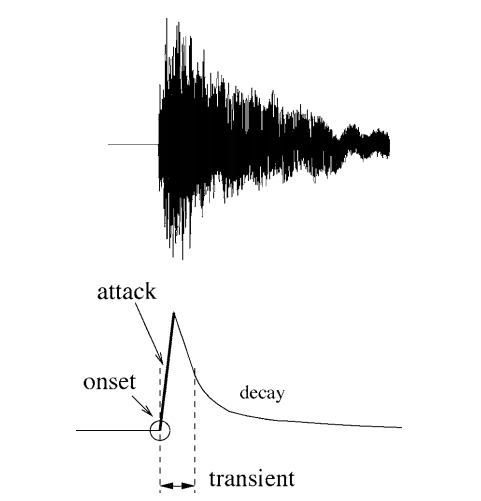
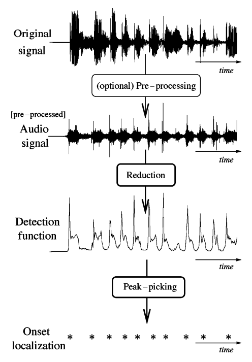

## ONSET DETECTION METHODS 

Approaches to onset detection can operate in the [time domain](https://en.wikipedia.org/wiki/Time_domain), [frequency domain](https://en.wikipedia.org/wiki/Frequency_domain), [phase](https://en.wikipedia.org/wiki/Phase_(waves)) domain, or [complex domain](https://en.wikipedia.org/wiki/Complex_plane), and include looking for:

- Increases in spectral energy
- Changes in spectral energy distribution ([spectral flux](https://en.wikipedia.org/wiki/Spectral_flux)) or [phase](https://en.wikipedia.org/wiki/Phase_(waves))
- Changes in detected pitch - e.g. using a [polyphonic](https://en.wikipedia.org/wiki/Polyphony) [pitch detection algorithm](https://en.wikipedia.org/wiki/Pitch_detection_algorithm)
- Spectral patterns recognisable by [machine learning](https://en.wikipedia.org/wiki/Machine_learning) techniques such as [neural networks](https://en.wikipedia.org/wiki/Neural_network).

 **Transients vs. Onsets vs. Attacks**

 A central issue here is to make a clear distinction between the related concepts of transients, onsets and attacks because different applications have different needs. The similarities and differences between these key concepts are important to consider; it is similarly important to categorize all related approaches. Fig. 1 shows, in the simple case of an isolated note, how one could differentiate these notions.

* The **attack** of the note is the time interval during which the amplitude envelope increases.
* The concept of **transient** is more difficult to describe precisely. As apreliminary informal definition, transients are short intervals during which the signal evolves quickly in some nontrivial or relatively unpredictable way. In the case of acoustic instruments, the transient often corresponds to the period during which the excitation (e.g., a hammer strike) is applied and then damped, leaving only the slow decay at the resonance frequencies of the body. Central to this time duration problem is the issue of the useful time resolution: we will assume that the human ear cannot distinguish between two transients less than 10 ms apart. Note that the release or offset of a sustained sound can also be considered a transient period.
* The **onset** of the note is a single instant chosen to mark the temporally extended transient. In most cases, it will coincide with the start of the transient, or the earliest time at which the transient can be reliably detected.

 Figure shows, in the simple case of an isolated note, how one could differentiate these notions.

### ALGORITHM FOR ONSET DETECTION

Usually this algorithm is used for onset detection:

**1. PREPROCESSING**

- The concept of pre-processing implies the transformation of the original signal in order to accentuate or attenuate various aspects of the signal according to their relevance to the task in hand. 
- It is an optional step that derives its relevance from the process or processes to be subsequently performed. There are a number of different treatments that can be applied to a musical signal in order to facilitate the task of onset detection. 
- There are a number of different treatments that can be applied to a musical signal, but *Multiple Bands* and *Transient / Steady state separation* are communally used.  

**2 . REDUCTION**

- In the context of onset detection, the concept of reduction refers to the process of transforming the audio signal into a highly subsampled detection function which manifests the occurrence of transients in the original signal. 
- This is the key process in a wide class of onset detection schemes and will therefore be the focus of most of our review. We will broadly divide reduction methods in two groups : 
  1. *Methods based on the use of explicitly predefined signal features*
  2. Methods *based on probabilistic signal models.*

**3. PEAK-PICKING**

- If the detection function has been suitably designed, then onsets or other abrupt events will give rise to well-localized identifiable features in the detection function. 
- Commonly, these features are local maxima (i.e. peaks), generally subject to some level of variability in size and shape, and masked by ‘noise’, either due to actual noise in the signal, or other aspects of the signal not specifically to do with onsets, such as vibrato. 
- Therefore a robust peak-picking algorithm is needed to estimate the onset times of events within the analysis signal. We will divide the process of peak-picking a detection function in three steps: ***post-processing***,  ***thresholding***, and a ***final decision process***.

## Onset Detection Functions 

Onset detection function(ODF) is primarily an undersampled version of the original music signal. *We divide the signal into partially overlapping frames and the ODF consists of one value for each frame. By the definition of an onset, we can say that onset detection is the process of identifying which parts of a signal are relatively unpredictable.* 

Hence, each value in an ODF should give a good indication as to the measure of the unpredictability of that frame. The vector of these values (obtained using methods discussed later) is passed to the peak-detection algorithm for onset detection.

### Types of ODFs

Some standard ODFs are: 

1. Energy Method
2. Spectral Difference Method
3. Complex Domain Method

**Energy Method** : 

- This is the most simple and computationally efficient method. In this method, we assume that *the onsets correspond to a higher energy component than the steady state notes in the music signal.* 

**Spectral Difference Method** : 

- This method is successful in detecting onsets in polyphonic signals and *soft* onsets.

- This is achieved by identifying time varying changes in a frequency domain representation of audio signal.

**Complex Domain Method **:

- Insted of making predictions only on the magnitudes like a spectral difference method, this method attempts to improve the prediction for the next value of a given bin using combined magnitude and phase information. 

