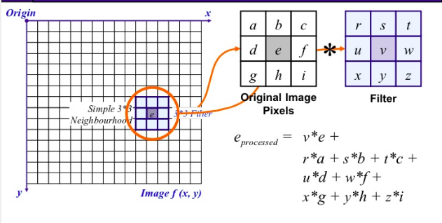
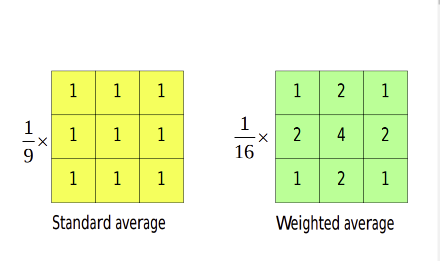
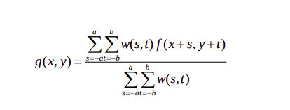
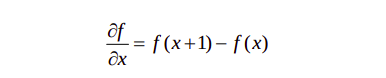
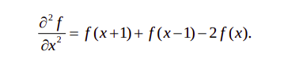

# Spatial Filtering

- Spatial filtering is an image processing technique for changing the intensities of a pixel according to the intensities of the *neighboring pixels*. 

- Using spatial filtering, the image is transformed **(convoluted)** based on a kernel H which has certain height and width (x,y), defining both the area and the weight of the pixels within the initial image that will replace the value of the image. The corresponding process is to convolve the input image I(i,j) with the filter function H(x,y), to produce the new filtered image:

  $$
  I' (i, j) = I(i, j) * H(x, y)
  $$
  

  

## Classification

  - Classification on the basis of linearity
     	1.  Linear Spatial Filter
     	2.  Non-Linear Spatial Filter

- General Classification

  1. Smoothing Spatial Filters

     * Mean Filter (or smoothing linear filter)

       -> Averaging Filter

       -> Weighted Averaging Filter

     * Order Statistic Filter

       -> Minimum Filter

       -> Maximum Filter

       -> Median Filter

  2. Sharpening Spatial Filters (Derivative Filters)

     - First Order Derivative
     - Second Order Derivative

## Linear Spatial Filters

The result is the sum of products of the mask coefficients with the corresponding pixels directly under the mask.

The coefficient w(0,0) coincides with image value f(x,y), indicating that the mask is centered at (x,y) when the computation of sum of products takes place.

For a mask of size m*n, we assume that m-2a+1 and n=2b+1, where a and b are non-negative integer. Then m and n are odd.

In general, linear filtering of an image f of size M\*N with a filter mask of size m\*n is given by the expression:
$$
g(x, y) = \sum_{s = -1}^{a} \sum_{t = -b}^{b} w(s,t) \ *\ f (x+s, y+t)
$$
The process of linear filtering similar to a frequency domain concept called "convolution"

## Non Linear Spatial Filter

Nonlinear spatial filters also operate on neighborhoods, and the mechanics of sliding a mask past an image are the same as was just outlined.

The filtering operation is based conditionally on the values of the pixels in the neighborhood under consideration

## Smoothing Spatial Filters

Smoothing filters are used for flurring and for noise reduction

- Blurring is used in preprocessing steps, such as removal of small details from an image prior to object extraction and bridiging of small gaps in lines or curves.
- Noise reduction can be accomplished by blurring

### Mean Filters

Here the idea is replacing the value of every pixel in an image by the average of the gray levels in the neighborhood defined by the filter mask.

The general implementation for filtering an M\*N image with weighted averaging filter of size m\*n is given by expression: 

### Order Statistic Filters

There are mainly 3 types of order statistic filters: max, min and median order statistic filter. As name suggests we replace the middle element of the window by maximum, minimum or median value respectively.

## Sharpening Spatial Filters

- Purpose of sharpening spatial filters are opposite of the smoothing filters. its main focus is *removal of blurring and highlight the edges*.

- We are interested in the behavior of these derivatives in areas of constant gray level(flat segments), at the onset and end of discontinuities(step and ramp discontinuities), and along gray-level ramps. 

- These types of discontinuities can be noise points, lines, and edges.

### First order derivative: 

- Must be zero in flat segments 

-  Must be nonzero at the onset of a gray-level step or ramp

-  Must be nonzero along ramps.

  Basic definition of the first order derivative of a one-dimentional function f(x) is:

  

### Second order derivative:

- Must be zero in flat areas.

-  Must be nonzero at the onset and end of a gray-level step or ramp.

-  Must be zero along ramps of constant slope.

  Definition:

  

